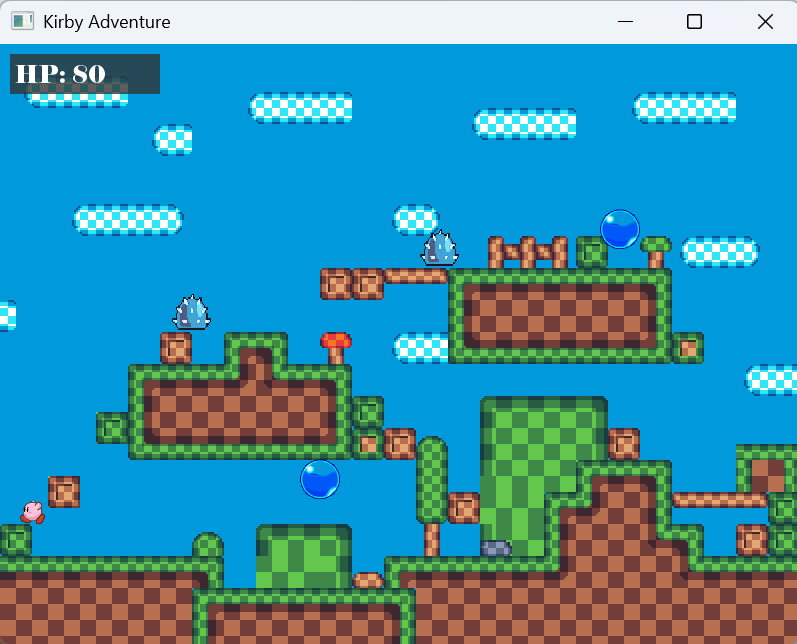
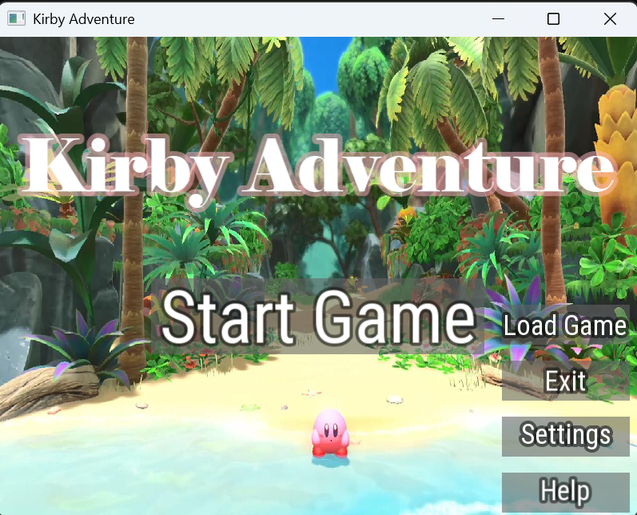
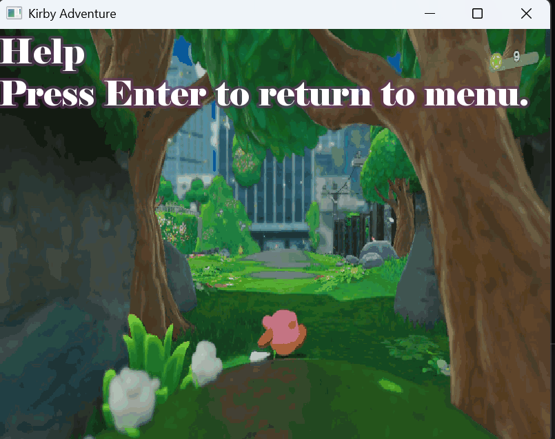
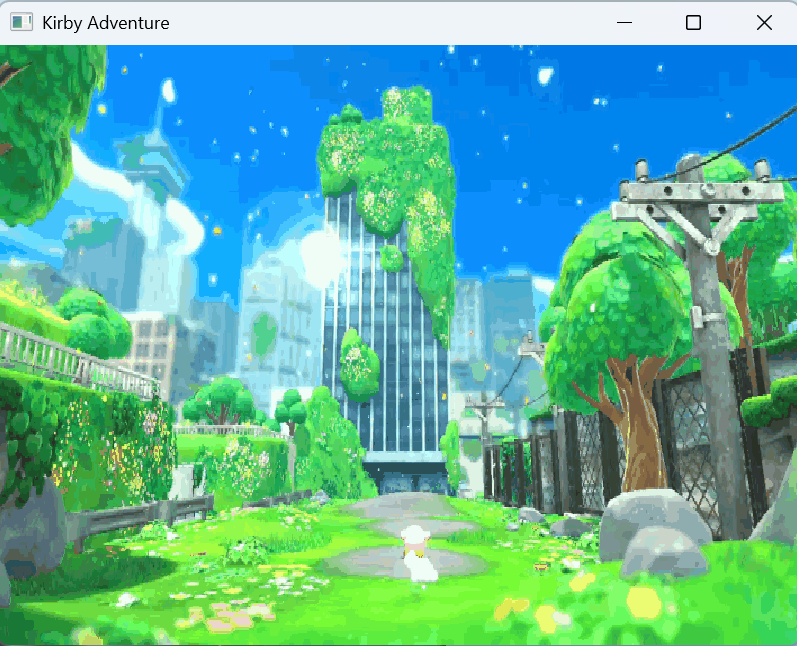
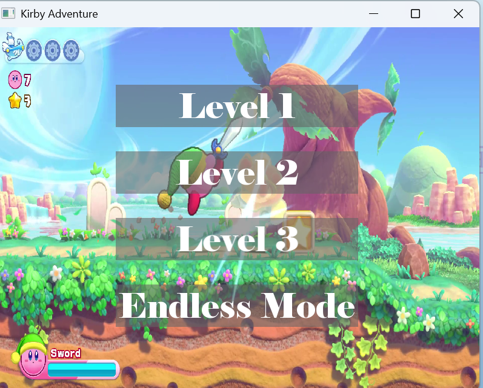
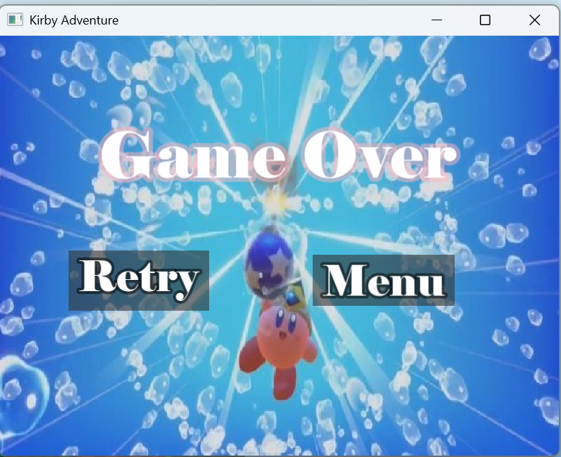
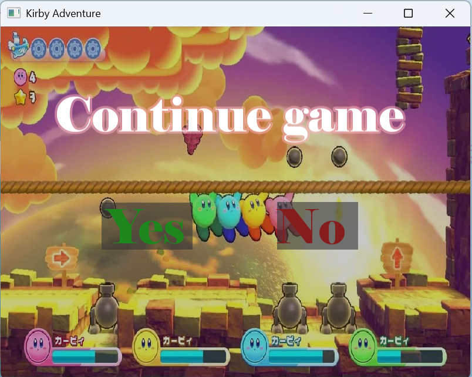

# 项目简介
1. 项目名称：星之卡比青春版
2. 项目描述：星之卡比青春版是一款依托于经典IP星之卡比的 2D 平台跳跃游戏，玩家将控制可爱的卡比在不同的关卡中冒险，收集道具，打败敌人。
3. 项目背景及成员：这是XMU24级大一小学期程序设计实践A的大作业，由Echowanderer-night、SeraphinaTAJ、CatNebulaaaa三人合力完成，由于时间紧张，开发的比较粗糙，很多细节没有打磨好，但还是希望能给未来的学弟学妹带来一些灵感

# 安装和运行
1. 克隆项目到本地
2. SFML：本项目基于VisualStudio 2022和SFML3.0.0版本构建，请先到官网下载对应版本（不同版本语法差别还挺大的），下载完成后把SFML3.0.0的文件夹放到主文件夹中，并且按照官网教程在vs中配置SFML
3. tinyxml2：解析地图文件的时候需要用到tinyxml2，请在GitHub上搜索并下载该项目，将tinyxml2.cpp和tinyxml2.h放到主文件夹中
4. 完成以上步骤后用VisualStudio打开.sln文件，生成解决方案，此时在文件夹中会生成x64文件，在复制SFML文件夹中的.dll文件到./x64/Debug/下，即.exe同级文件夹下
5. 将SFML3.0.0文件夹中的.dll文件复制一份到./x64/Debug中，即.exe同级文件夹中
6. 运行画面展示：
   
   
   
   
   
   
   

# 项目结构
ourgame/
├── src/              # 源代码文件
├── include/          # 头文件
├── assets/           # 游戏资源文件（图片、音频、字体等）
├── tinyxml2.cpp、tinyxml2.h         # 解析tmx文件依赖的第三方库
├── SFML/      # SFML3.0.0文件
└── ...

# 许可证
本项目采用 [MIT许可证](LICENSE) 发布